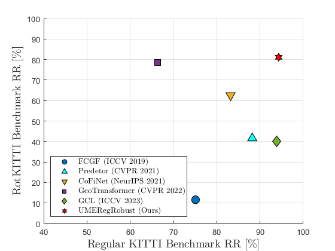

<div style="text-align: center;">

# UMERegRobust - Universal Manifold Embedding Compatible Features for Robust Point Cloud Registration (ECCV 2024)


[](https://paperswithcode.com/sota/point-cloud-registration-on-rotkitti?p=umeregrobust-universal-manifold-embedding)
</div>


<hr>


<p align="center">
  
  
</p>

In this work, we adopt the Universal Manifold Embedding (UME) framework 
for the estimation of rigid transformations and extend it, so that it can 
accommodate scenarios involving partial overlap and differently sampled point clouds.
UME is a methodology designed for mapping observations  of the same object,
related by rigid transformations, into a single low-dimensional linear subspace.
This process yields a transformation-invariant representation of the observations,
with its matrix form representation being covariant (i.e. equivariant) with the transformation.
We extend the UME framework by introducing a UME-compatible feature extraction method augmented 
with a unique UME contrastive loss and a sampling equalizer.
These components are integrated into a comprehensive and robust registration pipeline,
named _UMERegRobust_. We propose the RotKITTI registration benchmark,
specifically tailored to evaluate registration methods for scenarios involving large rotations.
UMERegRobust achieves better than state-of-the-art performance on the KITTI benchmark,
especially when strict precision  of $(1^\circ, 10cm)$ is considered (with an average gain of +9%),
and notably outperform SOTA methods on the RotKITTI benchmark
(with +45% gain compared the most recent SOTA method).

**Paper Link:** [https://www.arxiv.org/abs/2408.12380](https://www.arxiv.org/abs/2408.12380) <br>

<hr>

## Method Overview

<hr>

## Environment Setup

### Code was tested on:
   * Ubuntu 20.04
   * Python 3.8
   * Cuda 11.7
   * Pytorch 1.13.0+cu117

### Special Packages Used:
   * [MinkowskiEngine](https://github.com/NVIDIA/MinkowskiEngine)
   * [Pytorch3D](https://github.com/facebookresearch/pytorch3d)
   * [PyTorch Scatter](https://github.com/rusty1s/pytorch_scatter)
   * [NKSR](https://github.com/nv-tlabs/NKSR)

### Create Env:

 ```bash
 # Create Conda Env
 conda create umereg_conda_env python=3.8
 
 # Install CUDA Toolkit 11.7
 conda install nvidia/label/cuda-11.7.0::cuda-toolkit
 conda install conda-forge::cudatoolkit-dev
 
 # Git for Conda
conda install git

# Install Pytorch 1.13.0+cu117
pip install torch==1.13.0+cu117 torchvision==0.14.0+cu117 torchaudio==0.13.0 --extra-index-url https://download.pytorch.org/whl/cu117

# Install MinkowskiEngine 
 pip install -U git+https://github.com/NVIDIA/MinkowskiEngine -v --no-deps --config-settings="--blas_include_dirs=${CONDA_PREFIX}/include" --config-settings="--blas=openblas"
 
 # Install Pytorch3D + torch_scatter
 pip install "git+https://github.com/facebookresearch/pytorch3d.git"
 pip install torch-scatter -f https://data.pyg.org/whl/torch-1.13.0+cu117.html
 
 # NKSR
 pip install -U nksr -f https://nksr.huangjh.tech/whl/torch-1.13.0+cu117.html

# Other Relevant Packages
 pip install open3d
 pip install tensorboard
 ```
### Clone UMERegRobust Repository:
 ```bash
git clone https://github.com/yuvalH9/UMERegRobust.git
 ```

<hr>

##  Datasets

You can evaluate or train UMERegRobust on both the KITTI dataset and the nuScenes dataset.

Please refer to the detailed datasets guidelines:
   * [KITTI Guideline](assets/KITTI_Install_Guideline.md)
   * [nuScenes Guideline](assets/Nuscenes_Install_Guideline.md)
<hr>

## Sampling Equalizer Module (SEM) Preprocessing
To use the SEM to preprocess the input point cloud please use:


```bash
python datasets/sem_preprocessing.py --dataset_mode [kitti\nuscenes] --split [train\val] --data_path path_to_input_data --output_path path_to_output
```

We also supply download links to the SEM already preprocessed data for both KITTI (test, lokitt, rotkitti) and nuScenes  (test, lonuscenes, rotnuscens) registration benchmarks.
   * [Download KITTI registration benchmark preprocessed data](https://postbguacil-my.sharepoint.com/:u:/g/personal/haitman_post_bgu_ac_il/ER_myrIw1wBOuOTKmljWOLMBC88eQYyxQq9LJqMNyEId6w?e=4oDJRY)
   * [Download nuScenes registration benchmark preprocessed data](https://postbguacil-my.sharepoint.com/:u:/g/personal/haitman_post_bgu_ac_il/EagTNRZtftpIvvw3TNeRNfgB1TcXp0qX62xJiuOqaPwYSA?e=nqjPAZ)

    
<hr>

## RotKITTI & RotNuscenes Registration Benchmarks
We suggest new registration benchmarks RotKITTI and RotNuscenes, these benchmarks focus on point cloud pairs with big relative rotations in the wild (not synthetic rotations).
Each benchmark contains registration problems with relative rotations ranging between 30-180 degrees. We encourage the comunity to test thier method on those benchmakrs.

To use the benchmarks, first download the KITTI \ nuScenes datasets as described in [section Datasets](#datasets).
Next, the registration problems (source-target pairs) are saved in the files
[rotkitti_metadata.npy](datasets/kitti/metadata/rotkitti_metadata.npy) and
[rotnuscenes_metadata.npy](datasets/nuscenes/metadata/rotnuscenes_metadata.npy),
along with there corresponding GT transformations in the files
[rotkitti_gt_tforms.npy](datasets/nuscenes/metadata/rotkitti_gt_tforms.npy) and
[rotnuscenes_metadata.npy](datasets/nuscenes/metadata/rotnuscenes_metadata.npy),
respectively. 
<hr>

## Usage

### Eval
1. Download the original data as described in [section Datasets](#datasets) to `data_path`.
2. Download the SEM preprocessed data as described in [section SEM Preprocessing](#sampling-equalizer-module-sem-preprocessing) to `cache_data_path`.
3. Update paths in relevant [benchmark config files](configs/benchmarks).
4. Evaluate KITTI benchmarks:
   ```bash
   python evaluate.py --benchmark [kitti_test\lokitti\rotkitti]
   ```
5. Evaluate nuScenes benchmarks:
   ```bash
   python evaluate.py --benchmark [nuscenes_test\lonuscenes\rotnuscenes]
   ```
### Train
1. Download the original data as described in [section Datasets](#datasets) to `data_path`.
2. Run the SEM preprocessing for `train` and `val` splits as described in [section SEM Preprocessing](#sampling-equalizer-module-sem-preprocessing) output data to `cache_data_path`.
3. Update paths in relevant [train config files](configs/train).
4. Train KITTI:
   ```bash
   python train_coloring.py --config kitti
   ```
5. Train nuScenes benchmarks:
   ```bash
   python train_coloring.py --config nuscenes
   ```

<hr>

## Results - KITTI Benchmarks

### KITTI Test
| Method                                                               | Normal Precision <br/>(1.5°, 30 cm)  |    Strict Precision <br/>(1°, 10 cm)    |
|----------------------------------------------------------------------|:------------------------------------:|:---------------------------------------:|
| [FCGF](https://github.com/chrischoy/FCGF)                            |                 75.1                 |                  73.1                   |
| [Predetor](https://github.com/prs-eth/OverlapPredator)               |                 88.2                 |                  58.7                   |
| [CoFiNet](https://github.com/haoyu94/Coarse-to-fine-correspondences) |                 83.2                 |                  56.4                   |
| [GeoTrans](https://github.com/qinzheng93/GeoTransformer)             |                 66.3                 |                  62.6                   |
| [GCL](https://github.com/liuQuan98/GCL)                              |                _93.9_                |                 _78.6_                  |
| UMERegRobust                                                         |               **94.3**               |                **87.8**                 |

**Table1:** KITTI Benchmark - Registration Recall [%]

### RotKITTI
| Method          | Normal Precision <br/>(1.5°, 30 cm)  | Strict Precision <br/>(1°, 10 cm)  |
|-----------------|:------------------------------------:|:----------------------------------:|
| [FCGF](https://github.com/chrischoy/FCGF)         |                 11.6                 |                3.6                 |
|[Predetor](https://github.com/prs-eth/OverlapPredator)   |                 41.6                 |                35.0                |
| [CoFiNet](https://github.com/haoyu94/Coarse-to-fine-correspondences)    |                 62.5                 |                30.1                |
| [GeoTrans](https://github.com/qinzheng93/GeoTransformer)  |                _78.5_                |               _50.1_               |
| [GCL](https://github.com/liuQuan98/GCL)       |                 40.1                 |                28.8                |
| UMERegRobust            |               **81.1**               |              **73.3**              |

**Table2:** RotKITTI Benchmark - Registration Recall [%]

### LoKITTI
| Method          | Normal Precision <br/>(1.5°, 30 cm)  | Strict Precision <br/>(1°, 10 cm)  |
|-----------------|:------------------------------------:|:----------------------------------:|
| [FCGF](https://github.com/chrischoy/FCGF)       |                 17.2                 |                6.9                 |
| [Predetor](https://github.com/prs-eth/OverlapPredator) |                 33.7                 |               _28.4_               |
| [CoFiNet](https://github.com/haoyu94/Coarse-to-fine-correspondences)    |                 11.2                 |                1.0                 |
| [GeoTrans](https://github.com/qinzheng93/GeoTransformer)  |                 37.8                 |                7.2                 |
| [GCL](https://github.com/liuQuan98/GCL)       |               **72.3**               |                26.9                |
| UMERegRobust            |                _59.3_                |              **30.2**              |

**Table3:** LoKITTI Benchmark - Registration Recall [%]
<hr>

## Results - nuScenes Benchmarks
### nuScenes Test
| Method          | Normal Precision <br/>(1.5°, 30 cm)  | Strict Precision <br/>(1°, 10 cm)  |
|-----------------|:------------------------------------:|:----------------------------------:|
|[FCGF](https://github.com/chrischoy/FCGF)        |                 58.2                 |                37.8                |
| [Predetor](https://github.com/prs-eth/OverlapPredator)   |                 53.9                 |                48.1                |
| [CoFiNet](https://github.com/haoyu94/Coarse-to-fine-correspondences)  |                 62.3                 |                56.1                |
| [GeoTrans](https://github.com/qinzheng93/GeoTransformer)   |                 70.7                 |                37.9                |
| [GCL](https://github.com/liuQuan98/GCL)         |                _82.0_                |               _67.5_               |
| UMERegRobust            |               **85.5**               |              **76.0**              |

**Table4:** nuScenes Benchmark - Registration Recall [%]

### RotNuscenes
| Method          | Normal Precision <br/>(1.5°, 30 cm)  | Strict Precision <br/>(1°, 10 cm)  |
|-----------------|:------------------------------------:|:----------------------------------:|
| [FCGF](https://github.com/chrischoy/FCGF)       |                 5.5                  |                5.2                 |
| [Predetor](https://github.com/prs-eth/OverlapPredator)   |                 16.5                 |                15.7                |
| [CoFiNet](https://github.com/haoyu94/Coarse-to-fine-correspondences)    |                 27.0                 |               _23.6_               |
| [GeoTrans](https://github.com/qinzheng93/GeoTransformer)   |                _34.3_                |                13.1                |
| [GCL](https://github.com/liuQuan98/GCL)      |                 21.0                 |                19.6                |
| UMERegRobust            |               **51.9**               |              **39.7**              |

**Table5:** RotNuScenes Benchmark - Registration Recall [%]

### LoNuscenes
| Method          | Normal Precision <br/>(1.5°, 30 cm)  | Strict Precision <br/>(1°, 10 cm)  |
|-----------------|:------------------------------------:|:----------------------------------:|
| [FCGF](https://github.com/chrischoy/FCGF)      |                 1.9                  |                0.0                 |
| [Predetor](https://github.com/prs-eth/OverlapPredator)     |                 35.6                 |                4.2                 |
|  [CoFiNet](https://github.com/haoyu94/Coarse-to-fine-correspondences)    |                 30.3                 |               _23.5_               |
| [GeoTrans](https://github.com/qinzheng93/GeoTransformer)    |                 48.1                 |                17.3                |
| [GCL](https://github.com/liuQuan98/GCL)         |                _62.3_                |                5.6                 |
| UMERegRobust            |               **70.8**               |              **56.3**              |

**Table6:** LoNuScenes Benchmark - Registration Recall [%]

<hr>

## Citation
If you find this work useful, please cite:
```bibtex
@misc{haitman2024umeregrobust,
      title={UMERegRobust - Universal Manifold Embedding Compatible Features for Robust Point Cloud Registration}, 
      author={Yuval Haitman and Amit Efraim and Joseph M. Francos},
      year={2024},
      eprint={2408.12380},
      archivePrefix={arXiv},
      primaryClass={cs.CV},
      url={https://arxiv.org/abs/2408.12380}, 
}
```
<hr>

[//]: # ()
[//]: # (## Acknowledgements)
